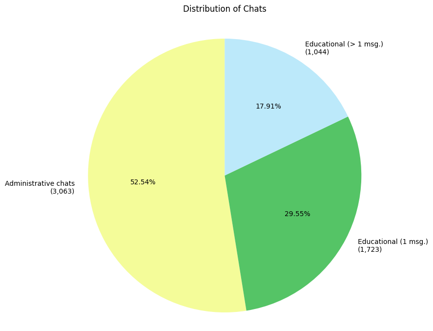
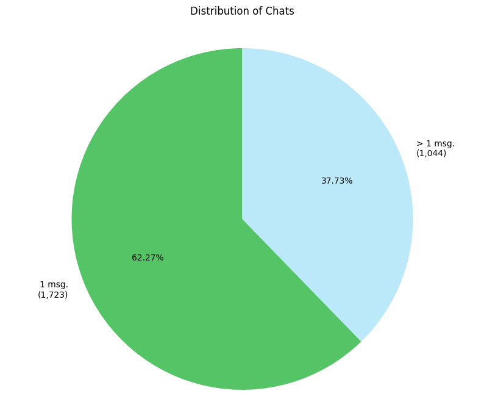
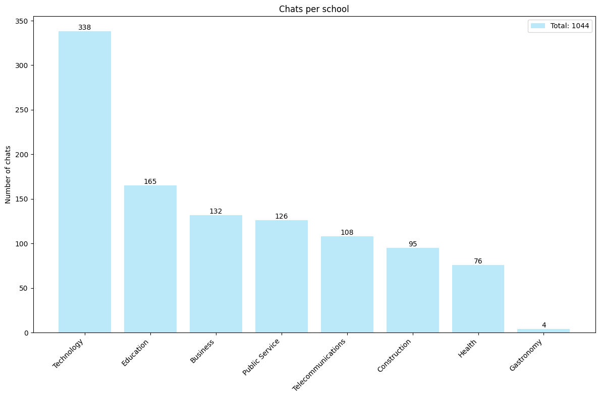
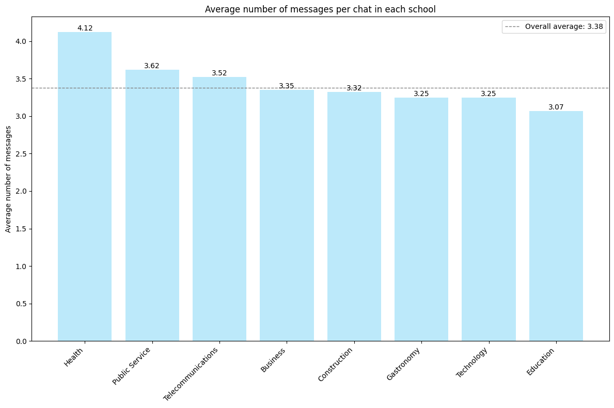
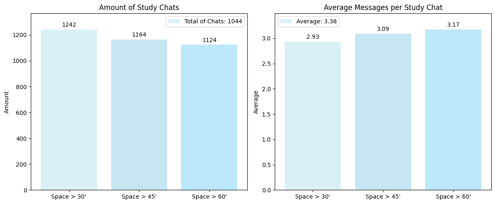

<!-- .slide: data-background-opacity="0.2" data-background-image="img/title.jpg" data-transition="convex" -->
# Iplacex
<!-- .element: style="margin-bottom:10px; font-size: 60px; color:white; font-family: Comic Sans MS;" -->

Rodrigo Prestes Machado
<!-- .element: style="margin-bottom:10px; font-size: 30px; color:white; font-family:Optima;" -->
rprestes@it.uc3m.es
<!-- .element: style="margin-bottom:100px; font-size: 30px; color:black; font-family:Optima;" -->

Press 'F' to full screen
<!-- .element: style="margin-bottom:10px; font-size: 15px; color:white; font-family:Optima;" -->

[pdf version](?print-pdf)
<!-- .element: style="margin-bottom 35px; font-size: 15px; color:black; font-family:Optima;" -->

<!-- .slide: data-background="#FFFF" data-transition="convex" -->
<!-- .element: style="margin-bottom:20px; font-size: 38px; color:black; font-family: Comic Sans MS;" -->

<!-- .slide: data-background="#FFFF" data-transition="convex" -->
<!-- .element: style="margin-bottom:20px; font-size: 38px; color:black; font-family: Comic Sans MS;" -->

<!-- .slide: data-background="#FFFF" data-transition="convex" -->
<!-- .element: style="margin-bottom:20px; font-size: 38px; color:black; font-family: Comic Sans MS;" -->

<!-- .slide: data-background="#FFFF" data-transition="convex" -->
<!-- .element: style="margin-bottom:20px; font-size: 38px; color:black; font-family: Comic Sans MS;" -->

<!-- .slide: data-background="#FFFF" data-transition="convex" -->
<!-- .element: style="margin-bottom:20px; font-size: 38px; color:black; font-family: Comic Sans MS;" -->

<!-- .slide: data-background="#FFFF" data-transition="convex" -->
## Spacing
<!-- .element: style="margin-bottom:80px; font-size: 38px; color:black; font-family: Comic Sans MS;" -->

* 30-minute: increase in the number of study chats (from 1,044 to 1,242: +18.9%)
and a decrease in the average number of messages per study chat (from 3.38 to 2.93: -13.3%).
<!-- .element: style="margin-bottom:70px; font-size: 24px; color:black; font-family: Helvetica;" -->

* 45-minute: increase in the number of study chats (from 1,044 to 1,164: +11.5%)
and a decrease in the average number of messages per study chat (from 3.38 to 3.09: -8.5%).
<!-- .element: style="margin-bottom:70px; font-size: 24px; color:black; font-family: Helvetica;" -->

* 60-minute: increase in the number of study chats (from 1,044 to 1,124: +7.6%)
and a decrease in the average number of messages per study chat (from 3.38 to 3.17: -6.2%).
<!-- .element: style="margin-bottom:50px; font-size: 24px; color:black; font-family: Helvetica;" -->

<!-- .slide: data-background="#FFFF" data-transition="convex" -->
<!-- .element: style="margin-bottom:20px; font-size: 38px; color:black; font-family: Comic Sans MS;" -->

<!-- .slide: data-background="#FFFF" data-transition="convex" -->
## Chat size
<!-- .element: style="margin-bottom:80px; font-size: 38px; color:black; font-family: Comic Sans MS;" -->

* 471 chats have more than 2 message held by 248 students (F: 122 (49.2%), M: 126 (50.8%))
<!-- .element: style="margin-bottom:50px; font-size: 24px; color:black; font-family: Helvetica;" -->

* 1723 chats have only 1 message held by 1204 students (F: 463 (38.5%), M: 741 (61.5%))
<!-- .element: style="margin-bottom:50px; font-size: 24px; color:black; font-family: Helvetica;" -->

* p-valor = 0.00215
<!-- .element: style="margin-bottom:50px; font-size: 24px; color:black; font-family: Helvetica;" -->

* Analysis shows that women are more likely to engage in chats with more than 2
messages than men.
<!-- .element: style="margin-bottom:50px; font-size: 24px; color:black; font-family: Helvetica;" -->

<!-- .slide: data-background="#FFFF" data-transition="convex" -->
## Chat size
<!-- .element: style="margin-bottom:80px; font-size: 38px; color:black; font-family: Comic Sans MS;" -->

* 176 chats have more than 4 messages held by 79 students (F: 48 (60.8%), M: 31 (39.2%))
<!-- .element: style="margin-bottom:50px; font-size: 24px; color:black; font-family: Helvetica;" -->

* 1723 chats have only 1 message held by 1204 students (F: 463 (38.5%), M: 741 (61.5%))
<!-- .element: style="margin-bottom:50px; font-size: 24px; color:black; font-family: Helvetica;" -->

* p-value: 0.000142
<!-- .element: style="margin-bottom:50px; font-size: 24px; color:black; font-family: Helvetica;" -->

* Women are more active in chats with over 4 messages, while men are more common
in single-message chats — a statistically significant difference.
<!-- .element: style="margin-bottom:50px; font-size: 24px; color:black; font-family: Helvetica;" -->

